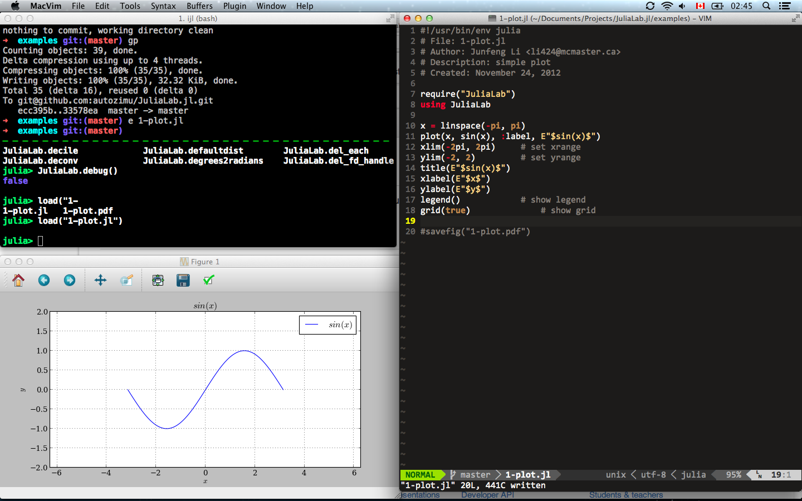

## Objective

Create comfortuable working environment for scientific computing using [Julia][].

## Main Work

* Graphical solution based on matploblib (mainly pyplot module).
* Functions frequently used but hasn't been supported by the official Julia
team, like derivation, integration and eigenvalue problems.

## Why

The Julia team seems to favor graphics solutions from ground up, and the
standard solution has not been decided yet. I just cannot wait that
long, so I started my own.

[Julia]: http://julialang.org/ "The Julia Language"
