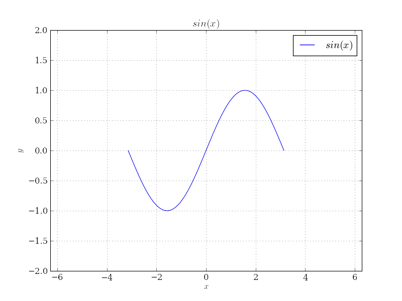
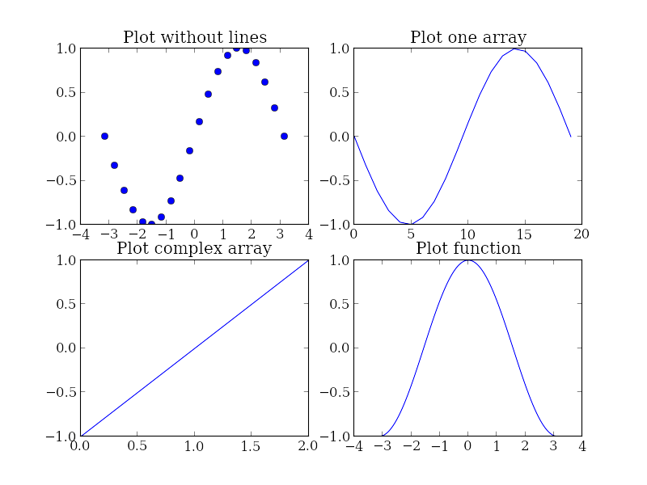
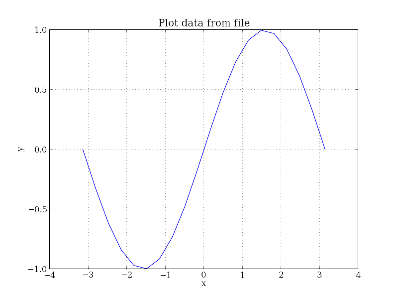
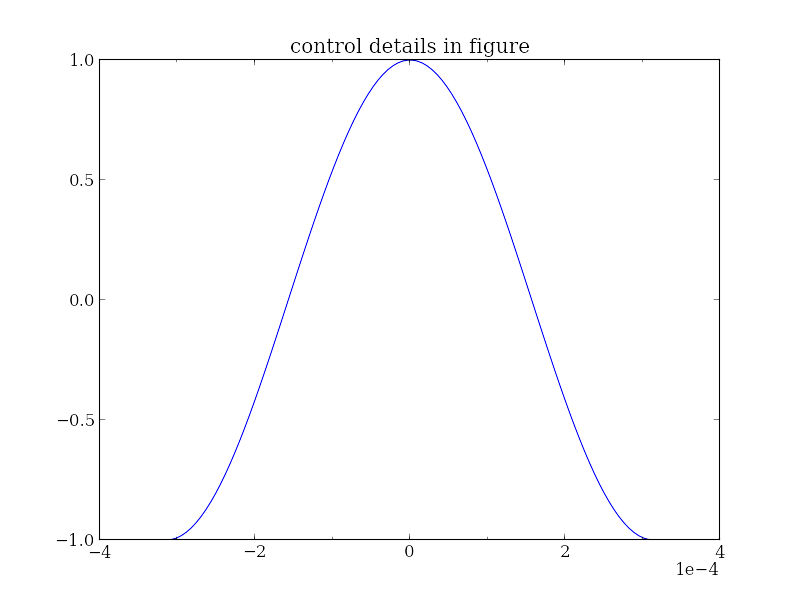

# demo

## 1-plot.jl

```julia
using PyPlot

x = linspace(-pi, pi)

figure()
plot(x, sin(x), label="\$sin(x)\$")
grid()
xlim(-2pi, 2pi)     # set xrange
ylim(-2, 2)         # set yrange
title("\$sin(x)\$")
xlabel("\$x\$")
ylabel("\$y\$")
legend()            # show legend

savefig("1-plot.png")
```



## 2-subplot.jl

```julia
using PyPlot

x = linspace(-pi, pi, 20)
y = sin(x)
cx = [-1 + 0im, 0 + 1im, 1 + 0im]

figure()

subplot(221)
title("Plot without lines")
plot(x, y, 'o')    # don't draw lines

subplot(222)
title("Plot one array")
plot(y)             # plot one array

subplot(223)
title("Plot complex array")
plot(cx)            # plot complex array

subplot(224)
title("Plot function")
plot(cos, -pi, pi)  # plot a function

savefig("2-subplot.png")
```



## 3-plotfile.jl

```julia
using PyPlot

figure()
plotfile("3-plotfile.txt", delimiter=" ", cols=(0, 1))
title("Plot data from file")

savefig("3-plotfile.png")
```



## 4-control-details.jl

```julia
using PyPlot

x = linspace(-pi, pi)
y = cos(x)
x = x / 1.0e4

figure()
plot(x, y)
title("control details in figure")
xloc(0.0002)            # set x axis (major) ticks
xloc_minor(0.0001)      # set x axis minor ticks
ticklabel_format(scilimits=(-3, 3))     # set scientific limit

savefig("4-control-details.png")
```



## Want More?

As mentioned before, this package is simply a wrapper around matplotlib,
the powerful python plot library. If you want find more details on the
plotting functions and available parameters, matplotlib's [website][mpl]
is a good place. And there is also a [gallery][] page to show how
powerful it could be. If you need some functions that have not yet been
wrapped by this module (this is highly possible, since I only exported
the functions that I think I will use in my simple research work), a
special function `pyplot.pyplot()` could be used to send arbitrary
matplotlib commands.  Also, it is quite easy to wrap those functions,
take `src/alias.jl` as example and make your own.

[mpl]: http://matplotlib.org/
[gallery]: http://matplotlib.org/gallery.html
